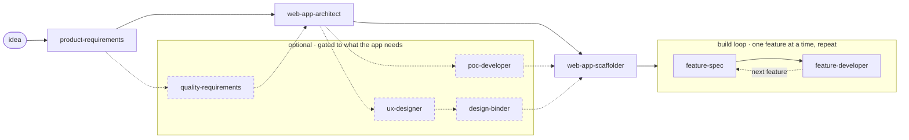
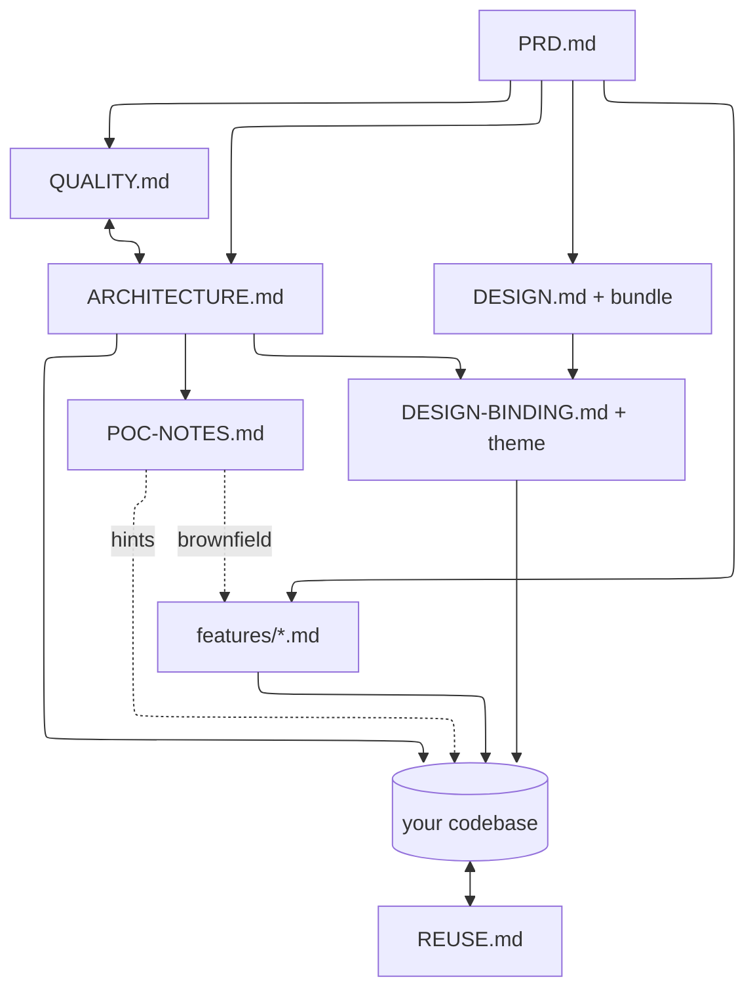

# Spec-Driven Build Skills for Claude Code

A chained set of Claude Code skills that take a web app from a rough idea to a running, verified foundation — **spec-first**. Each skill writes a file; the next one reads it. You never repeat yourself, and the architecture you get is sized to what the app actually needs instead of a one-size-fits-all template.

> **Looking for one skill in depth?** Each skill has its own reference page (how it works, sample prompts, what it produces, who depends on it) under [`docs/skills/`](docs/skills/README.md). This README is the overview and end-to-end walkthrough.

**The pipeline — order of stages.** The solid spine is always run; the dashed stages are optional and gated to what the app needs. After scaffolding you stay in the per-feature build loop.



**The artifacts — who reads whose file.** Each skill writes a file under `specs/` (or your codebase); the arrows show which downstream skill consumes it. The `QUALITY.md ⇄ ARCHITECTURE.md` seam is bidirectional — the architect designs to the targets, and an infeasible target routes back to renegotiate.



## The nine skills

Each skill below links to its own reference page — how it works, sample prompts, what it produces, and who depends on it. See [`docs/skills/`](docs/skills/README.md) for the full index.

| Skill | Stage | Reads | Writes |
|---|---|---|---|
| [`product-requirements`](docs/skills/product-requirements.md) | Define the product | the conversation | `specs/PRD.md` |
| [`web-app-architect`](docs/skills/web-app-architect.md) | Design the build | `specs/PRD.md` + `specs/QUALITY.md` (targets) | `specs/ARCHITECTURE.md` |
| [`quality-requirements`](docs/skills/quality-requirements.md) | Set non-functional targets *(optional)* | `specs/PRD.md` | `specs/QUALITY.md` |
| [`poc-developer`](docs/skills/poc-developer.md) | Spike a quick glimpse — or a "quick response" spike of one change against an existing app *(optional)* | `specs/ARCHITECTURE.md`; brownfield also reads the real code as context | `/poc/` (throwaway) + `specs/POC-NOTES.md` |
| [`ux-designer`](docs/skills/ux-designer.md) | Design the look & feel — a **portable** bundle *(optional)* | `specs/PRD.md` (persona/mood) + `specs/POC-NOTES.md` + `specs/ARCHITECTURE.md` | `specs/DESIGN.md` + `specs/design/` (portable bundle: neutral tokens + buildless preview + `BUNDLE.md`) |
| [`design-binder`](docs/skills/design-binder.md) | Wire the design system to **this** project *(optional)* | `specs/DESIGN.md` (the bundle) + `specs/PRD.md` + `specs/ARCHITECTURE.md` | `specs/DESIGN-BINDING.md` + `specs/design/themes/<project>` |
| [`web-app-scaffolder`](docs/skills/web-app-scaffolder.md) | Stand up the foundation | `specs/ARCHITECTURE.md` + `specs/POC-NOTES.md` + `specs/DESIGN.md` + `specs/DESIGN-BINDING.md` | your codebase |
| [`feature-spec`](docs/skills/feature-spec.md) | Detail one feature | `specs/PRD.md` + `specs/ARCHITECTURE.md` | `specs/features/<feature>.md` |
| [`feature-developer`](docs/skills/feature-developer.md) | Build one feature | `specs/features/<feature>.md` + `specs/ARCHITECTURE.md` + `specs/REUSE.md` + `specs/DESIGN.md` + `specs/DESIGN-BINDING.md` | code + tests + `specs/REUSE.md` |

They run in that order: **PRD → architecture → (optional PoC) → (optional design system → design binding) → scaffold**, then a per-feature **build loop**. [`quality-requirements`](docs/skills/quality-requirements.md) is the optional non-functional companion to the PRD — it sits after the PRD and **alongside the architect**, owning the *how-well* (performance, availability, security, accessibility, observability, and a first-class GDPR section) as measurable `NFR-0X` targets in `specs/QUALITY.md` that the architect designs to. The PoC is an optional, disposable spike — a clickable mock-data prototype — and it auto-detects two modes. **Greenfield** (no real app yet) shows what the app could feel like before committing, and leaves `specs/POC-NOTES.md` as hints the scaffolder reads so the real foundation starts closer to reality. **Brownfield** (a real app already exists) is a **"quick response" spike**: it reads the real code as context to learn the seam a change would plug into, builds just that change in `/poc` against a *mocked* version of the seam (never copying or touching real code), and hands off to `feature-spec` → `feature-developer` to build it for real.

The design layer is **two optional skills with a deliberate split**. `ux-designer` establishes the durable visual & interaction language as a **portable, project-agnostic bundle** — `specs/DESIGN.md` + `specs/design/` (stack-neutral tokens, a *zero-build* style-guide preview that opens with no app, and a `BUNDLE.md` manifest). Because it carries no project specifics, the bundle is **exportable**: copy it into another project and reuse the same design system. `design-binder` then **wires that portable system to *this* project** — reading the PRD's flows and the architecture's routes/stack to write `specs/DESIGN-BINDING.md` (which bundle components/tokens realize each screen, plus the chosen stack adapter) and a project **theme override** under `specs/design/themes/` (the brand instance, layered on the bundle without changing it). The scaffolder adopts **both** (the bundle as the language, the binding as how this project uses it) and every feature conforms to both.

The build loop is the `feature-spec` → `feature-developer` pair, run once per feature: the writer details how a feature behaves (and keeps the PRD's feature index pointing at it), the developer implements that behaviour as a tested vertical slice — reusing code from a registry it maintains (`specs/REUSE.md`) so it builds from pre-conceived context, staying within the architecture's rules and conforming to the design system + binding if they exist. Everything durable they produce lives together under one `specs/` folder.

## Installation

Each skill is a folder containing a `SKILL.md`. Drop them into one of Claude Code's skill locations:

```
.claude/skills/                 # project-level: committed with the repo, shared with your team
├── product-requirements/SKILL.md
├── web-app-architect/SKILL.md
├── quality-requirements/SKILL.md
├── poc-developer/SKILL.md
├── ux-designer/SKILL.md
├── design-binder/SKILL.md
├── web-app-scaffolder/SKILL.md
├── feature-spec/SKILL.md
└── feature-developer/SKILL.md
```

- **Project** (`.claude/skills/` in your repo) — travels with the codebase; good when you want the team to share them.
- **Personal** (`~/.claude/skills/`) — available across all your projects; good for general reuse. The two locations stack, so you can use both.

If the `.claude/skills/` directory didn't exist when your session started, restart Claude Code once so it gets watched. Edits to an existing `SKILL.md` are picked up live.

## How it works

You don't invoke these skills manually. Claude Code reads each skill's description and routes to the right one based on what you ask and which spec files already exist. So you just talk naturally:

- Which skill fires is decided by **intent + file state** — e.g. `web-app-architect` activates when you ask about building/structure *and* there's no `specs/ARCHITECTURE.md` yet; once it exists, the same skill switches to maintaining it.
- Each skill **reads the previous stage's output**, so you don't restate the product when you move to architecture, or restate the architecture when you scaffold.
- Each stage **pauses for your approval** before the next one runs. Review the `specs/` file, correct it, then continue.

You can also jump in anywhere: if you already have a PRD, start at architecture; if you already have an architecture, start at scaffold.

---

## Using it, stage by stage

### 1. Define the product → `specs/PRD.md`

Start here when you have an idea but no `specs/PRD.md`. The skill asks a short set of high-impact questions (what & who, problem & success, must-haves, non-goals, constraints), then writes the PRD.

**Example prompts:**
- "I want to build a tool that lets freelancers track invoices and send reminders. Help me write a PRD."
- "Let's spec out a new product: a reading tracker that syncs my Goodreads shelf."
- "Define the requirements for an internal dashboard my team will use to track weekly OKRs."

> It will ask a few questions before writing — answer them, or reply "defaults" to let it assume sensible ones and note them.

### 2. Design the build → `specs/ARCHITECTURE.md`

Run this when the PRD is approved. It reads the PRD first — pulling the project name, who logs in, integrations, and constraints — so it only asks what the PRD leaves open, then decides the stack and which architectural patterns the app actually needs (and switches off the ones it doesn't).

**Example prompts:**
- "The PRD's done — design the architecture."
- "How should we build this? Set up the ARCHITECTURE.md."
- "Decide the tech stack and structure for this app."

> Because it reads the PRD, a single-user local tool won't get multi-tenancy bolted on, and a SaaS will get tenant isolation, RBAC, and the rest — automatically.

### 2½. (Optional) Spike a quick glimpse → `/poc/` + `specs/POC-NOTES.md`

Run this when you want to *see* something working before committing to the real build. It throws together a clickable, **mock-data** prototype — no real auth, no real database, no live APIs — so you get a feel for it fast. The spike lands in a disposable `/poc/` folder; what lasts is `specs/POC-NOTES.md`, a short list of hints. It auto-detects which of two modes you're in:

- **Greenfield (no real app yet)** — prototypes the one flow that makes the *whole product* click, and the notes become hints the **scaffolder** reads next.
- **Brownfield (a real app already exists)** — a **"quick response" spike** of one *targeted change*: it reads your real code as context to learn the seam the change plugs into, builds just that change against a *mocked* version of that seam (it never copies, imports, or edits your real code), and the notes name the real seam and hand off to **`feature-spec` → `feature-developer`** to build it for real.

**Example prompts:**
- "Before we scaffold, throw together a quick PoC so I can see the reminder flow." *(greenfield)*
- "Mock up the UI for the dashboard — just enough to click through." *(greenfield)*
- "Spike what a bulk-reminder action would feel like in the current app." *(brownfield)*
- "Quick-response PoC of inline editing on the invoice list before we commit." *(brownfield)*

> It's optional and disposable. The PoC code is throwaway and takes shortcuts on purpose; the next stage reads only the *notes*, never the spike code, and the architecture always wins on any conflict. In brownfield it reads your real code only to learn the seam — it never copies or changes it. Skip it entirely if you'd rather go straight to building.

### 2¾. (Optional) Design the look & feel → `specs/DESIGN.md` + a portable bundle

Run this when the product has a real user-facing surface and you want one coherent visual language instead of each feature re-deciding colour, spacing, and component shape on its own. It reads the PRD (persona and mood), the PoC notes if present (the interaction patterns that were validated), and the architecture (the front-end stack), then establishes a **design system as a portable bundle**: semantic design tokens (colour/type/spacing/radius/motion), a base component inventory with their states, layout/navigation patterns, and an accessibility baseline. It writes `specs/DESIGN.md` (the contract) plus everything under `specs/design/` — **stack-neutral tokens** (`tokens.json` + `tokens.css`, the source of truth), optional stack adapters, a **zero-build** static style-guide preview (`preview/index.html`, opens in a browser with **no app, build step, or dev server**), and a `BUNDLE.md` manifest — so you can *see* the system immediately and **export it into another project**.

The bundle is deliberately **project-agnostic** (no flows, screens, or brand instance), which is exactly what makes it inheritable: copy `specs/DESIGN.md` + `specs/design/` into any repo and reuse the same design system.

**Example prompts:**
- "Set up the design system before we scaffold."
- "Define the look and feel — colours, typography, spacing, components."
- "Make it look polished and consistent — establish the visual language."
- "Make a portable/exportable design system we can reuse across projects."

> It's optional and gated: an internal admin panel, a dev tool, or an app that adopts an off-the-shelf component kit as-is doesn't need one, and the skill will say so rather than manufacturing noise. The preview is a *static* style guide (a gallery rendered once) — distinct from the PoC, which previews what *using the product* feels like. The architecture wins on *how* components are built; the design system governs *how they look*.

### 2⅞. (Optional) Wire the design system to this project → `specs/DESIGN-BINDING.md`

Run this right after the design bundle exists, to **connect that portable system to *your* project**. The bundle is the generic visual language; this skill (`design-binder`) makes it *this app's* design: it reads the PRD (flows/screens and your brand) and the architecture (routes + front-end stack), then writes `specs/DESIGN-BINDING.md` — a **screen/flow → component map** (which bundle components, tokens, and layout realize each screen), the **chosen stack adapter** the architecture consumes — plus a project **theme override** under `specs/design/themes/` (your brand colours layered on the bundle's semantic tokens, without changing the bundle). The scaffolder and every feature read the binding *alongside* the bundle, so screens are built from the right components, in your brand.

This is the second half of the portable-design split: **one exportable design artifact (the bundle) inheritable into any project, and one connecting artifact (the binding) that contextualizes it into your specific project.** Run a fresh binding in each project that inherits the same bundle.

**Example prompts:**
- "Wire the design system up to this project."
- "Map our screens to the design system's components."
- "Set our brand colour/theme on the design system, and pick the adapter for our stack."

> It's optional and gated like the design system — there's nothing to bind if no bundle exists (use `ux-designer` first), and a trivial single-screen app may not need a map. It never changes the portable bundle (that stays exportable); a missing component routes back to `ux-designer`, a missing flow back to `product-requirements`.

### 3. Stand up the foundation → your codebase

Run this once the architecture is approved. It reads `specs/ARCHITECTURE.md` (plus `specs/POC-NOTES.md` if a PoC was spiked, as advisory hints; `specs/DESIGN.md` + its bundle if a design system was established, adopting its tokens and base components; and `specs/DESIGN-BINDING.md` if a binding exists, wiring the chosen stack adapter, applying your project theme, and using its screen→component map for Phase-0 screens), scaffolds exactly the foundation the doc calls for (repo, stack, auth, the gated pieces, CI gate), and proves it against the architecture's own Phase-0 acceptance criteria. It builds the foundation only — not features.

**Example prompts:**
- "Scaffold the project and stand up Phase 0."
- "Bootstrap the repo from the architecture."
- "Set up the foundation and prove it works."

> It stops once the foundation boots, the CI gate is green, and the Phase-0 checks pass — then hands back to you to build features.

### 4. Build features, one at a time → spec then code *(the loop)*

With the foundation standing, you build features one by one, as a pair of steps per feature: **spec it, then build it.** Simple features stay as rows in the PRD; only complex ones earn their own spec. This is the repeating loop you'll spend most of the build in: **spec a feature → build it → repeat.**

**Spec it** — `feature-spec` writes `specs/features/<feature>.md`:
- "Spec out the invoice-reminder feature in detail — all the states and edge cases."
- "Flesh out the Goodreads sync module: what happens on conflicts, failures, first run?"

> It reads both the PRD and the architecture, traces back to the PRD requirement it expands (e.g. FR-03 → FR-03.1, FR-03.2…), and adds itself to the PRD's feature index.

**Build it** — `feature-developer` implements that spec as a tested vertical slice:
- "Build the invoice-reminder feature from its spec."
- "Implement the Goodreads sync module."

> It reads the feature spec (what to build) and the architecture (how to build — honouring its invariants, gates, and conventions), conforms to the design system if `specs/DESIGN.md` exists (its tokens, components, and a11y baseline) and builds the screen from `specs/DESIGN-BINDING.md`'s screen→component map in your project's theme if a binding exists, and proves the slice against the spec's own acceptance criteria. It also keeps `specs/REUSE.md`, a registry of reusable code it reads *before* building and updates *after* — so it reuses what exists instead of rediscovering the codebase each feature, and gets faster as the project grows. If the spec is missing a behaviour it needs, it routes back to `feature-spec`; if it needs a component or token the design system doesn't define, it routes back to `ux-designer`; if a screen has no/wrong component mapping or theme value, it routes back to `design-binder` — rather than improvising any of them.

---

## End-to-end example

A short walkthrough of one project moving through the stages:

1. **You:** "I want to build a tool for freelancers to track invoices and send payment reminders. Write a PRD."
   **→** A few questions, then `specs/PRD.md` (persona, goals/non-goals, functional requirements, the "sends reminders" + "connects to a payment provider" constraints).

2. **You:** "Now design the architecture."
   **→** It reads the PRD, sees single-user + a payment integration + scheduled reminders, and writes `specs/ARCHITECTURE.md` with a job/scheduler layer and webhook verification gated **on**, multi-tenancy gated **off**, plus a phased build plan.

3. **You:** "Before we build it for real, spike a quick PoC of the reminder flow." *(optional)*
   **→** It builds a throwaway `/poc/` with three mock-data screens you can click through, then writes `specs/POC-NOTES.md` — validated patterns, a reusable `ReminderTimeline` component, the data shape the UI needed, and a note that auth/DB are mocked. You get a feel for it without committing to anything.

4. **You:** "Set up a portable design system before we scaffold." *(optional)*
   **→** It reads the PRD (persona, mood) and the PoC notes (the inline timeline that landed), and writes `specs/DESIGN.md` plus the **portable bundle** under `specs/design/`: stack-neutral `tokens.json` + `tokens.css`, a **zero-build** `preview/index.html`, and `BUNDLE.md`. You double-click the preview — no app, no build — and *see* the system. It's project-agnostic, so you could drop it into a future project too.

5. **You:** "Wire it up to this project — brand colour is teal, we're on React + Tailwind." *(optional)*
   **→** `design-binder` reads the bundle, the PRD (flows/screens), and the architecture (stack), then writes `specs/DESIGN-BINDING.md` (mapping `/invoices`, `/invoices/:id`, `/invoices/new` to the bundle's table/card/timeline/form components + the sidebar shell, and selecting the Tailwind adapter) plus `specs/design/themes/invoicetracker.css` (primary → teal, contrast re-checked). The bundle stays untouched and exportable; this project is now fully wired.

6. **You:** "Scaffold Phase 0."
   **→** It reads the architecture (and the PoC notes as hints), adopts the bundle (tokens + base components) **and** the binding (wires the Tailwind adapter, applies the teal theme, sets up the mapped screens), and stands up the repo, stack, auth, the scheduler, the CI gate — then runs the Phase-0 checks until green and stops. The `/poc/` code is ignored; only the notes carry forward.

7. **You:** "Spec out the reminder feature — all the states and timing rules."
   **→** `specs/features/payment-reminders.md`, expanding the PRD's reminder requirement into flows, schedule rules, and failure behaviour; the PRD's feature index links to it.

8. **You:** "Now build the reminder feature."
   **→** `feature-developer` reads that spec (what) and the architecture (how), checks `specs/REUSE.md` and reuses the `ReminderTimeline` the PoC notes seeded, builds the slice with the design system's tokens and components — using the binding's screen→component map, in the teal theme — scheduler hook-up, all the states, tests — within the architecture's gates, proves it against the spec's acceptance criteria, and registers the new reusable bits it created. Then you loop back to spec the next feature.

From there you stay in the build loop on a proven foundation: spec a feature, build it, repeat — the reuse registry making each pass a little faster than the last.

## What you end up with

```
your-project/
├── specs/
│   ├── PRD.md                       # the product: what & why
│   ├── features/
│   │   └── payment-reminders.md     # one feature, in depth
│   ├── ARCHITECTURE.md              # the build: how
│   ├── POC-NOTES.md                 # hints from the spike (if a PoC was run)
│   ├── DESIGN.md                    # the design-system contract (if one was established)
│   ├── design/                      # the PORTABLE design bundle (exportable into other projects)
│   │   ├── tokens.json / tokens.css #   stack-neutral tokens (the source of truth)
│   │   ├── adapters/                #   optional, generated for your stack
│   │   ├── themes/                  #   your project's brand instance (written by design-binder)
│   │   ├── preview/index.html       #   zero-build style-guide (opens with no app)
│   │   └── BUNDLE.md                #   manifest + "adopt into a new project" recipe
│   ├── DESIGN-BINDING.md            # wires the bundle to THIS project (if a binding was made)
│   └── REUSE.md                     # registry of reusable code (grows as you build)
├── poc/ … (throwaway mock-data spike — deletable)
└── src/ … (scaffolded foundation + features, built to spec)
```

## Maintaining the specs

The skills don't just write once — each switches to a **maintain mode** when its file already exists:

- "Add a requirement to the PRD: let users export invoices to CSV." → updates `specs/PRD.md` and its changelog.
- "We're adding a paid SMS API — update the architecture." → revisits the affected gates in `specs/ARCHITECTURE.md`.
- "The reminder timing changed to 3 and 7 days before due." → updates the feature spec and keeps the PRD index link accurate.
- "Change how reminders are sent." → the spec changes first (behaviour), then `feature-developer` updates the code to match — never the other way round.

Keep the specs current and they stay the source of truth the whole build derives from.

## Design principles (why it behaves this way)

- **Gating, not templates.** Each skill includes only what the app needs. Patterns (multi-tenancy, queues, caching, a feature's own file) are switched on by explicit conditions and left off otherwise — it's cheaper to add later than to rip out.
- **One concept, one owner.** Product scope lives in the PRD, feature behaviour in feature specs, technical design in the architecture. No skill redoes another's job; they link instead of duplicating.
- **Ask only what matters, then assume.** Each stage asks a few high-impact questions and defaults the rest, recording assumptions rather than blocking on a long form.
- **Prove it.** The foundation isn't "done" because files exist — it's done when it boots and passes the architecture's acceptance criteria.
